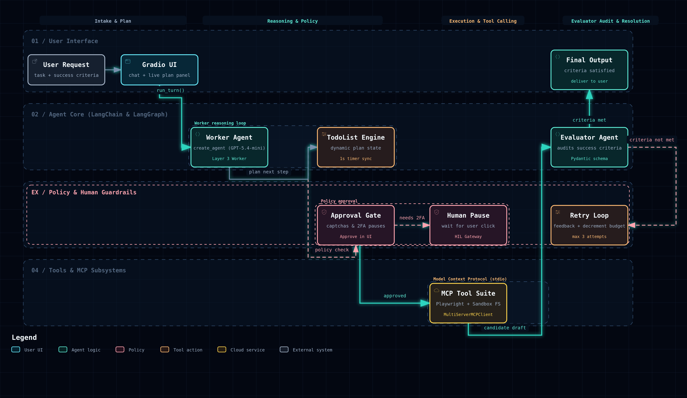

# LangChain Sidekick 🤖

An interactive, production-grade autonomous personal assistant co-worker built with **LangChain**, **LangGraph**, **Gradio**, and **OpenRouter**, equipped with persistent **Model Context Protocol (MCP)** browser & filesystem tools, live plan tracking, and a self-correcting **Evaluator Loop**.

[](https://huggingface.co/spaces/nakitadev/langchain-sidekick)
[](https://www.python.org/downloads/)
[](https://github.com/langchain-ai/langchain)
[](https://github.com/langchain-ai/langgraph)
[](https://gradio.app/)
[](https://modelcontextprotocol.io/)



---

## ✨ Features

- 💬 **Autonomous Worker Agent (Layer 3)**:
  - Powered by OpenRouter (`openai/gpt-5.4-mini` or any leading frontier model).
  - Handles complex multi-step user requests with tool orchestration and planning.
- 🔄 **Self-Correcting Evaluator Loop**:
  - Independent evaluator agent inspects candidate answers strictly against user **Success Criteria**.
  - Generates structured feedback (`success_criteria_met`, `user_input_needed`, `feedback`) and triggers automatic retries (up to 3 attempts).
- 🛠️ **Persistent Multi-Server MCP Tools**:
  - **Playwright MCP (`@playwright/mcp`)**: Headless Chromium automation for navigating dynamic web pages, capturing DOM snapshots, and dismissing cookie banners.
  - **Filesystem MCP (`@modelcontextprotocol/server-filesystem`)**: Sandboxed file read/write operations inside a dedicated `sandbox/` directory.
  - **Persistent stdio MCP Sessions**: Background asyncio processes keep browser sessions, cookies, and state alive across multi-step turns.
- 🛡️ **Comprehensive Middleware Protection Stack**:
  - `TodoListMiddleware`: Maintains a structured todo list synchronized in real time with the UI.
  - `PIIMiddleware`: Redacts sensitive emails and credit cards from prompts and tool outputs.
  - `ModelCallLimitMiddleware`: Enforces execution caps to prevent runaway token costs.
  - `TolerateToolErrors`: Traps external tool exceptions and passes them back as messages so the agent recalibrates gracefully.
- 🙋 **Human-in-the-Loop (HIL) Supervision**:
  - Automatically pauses execution when hitting captchas, logins, 2FA, or sensitive decisions, prompting for manual human approval.
- 🎨 **Modern Responsive UI & Hugging Face Space**:
  - Native Gradio 6 desktop interface with custom Montserrat typography and brand palette.
  - Instant zero-setup static web demo hosted on Hugging Face Spaces with interactive simulation presets and direct OpenRouter execution.

---

## 🏗️ Architecture

```text
                                  ┌───────────────────────────────────────────────┐
                                  │            User Request & Criteria            │
                                  │        ("Find flights" + "Under $800")        │
                                  └───────────────────────┬───────────────────────┘
                                                          │
                                                          ▼
                                  ┌───────────────────────────────────────────────┐
                                  │      Layer 3 Worker Agent (create_agent)      │
                                  │           OpenRouter (GPT-5.4-mini)           │
                                  └───────────────┬───────────────┬───────────────┘
                                                  │               │
                         ┌────────────────────────┘               └────────────────────────┐
                         │                                                                 │
                         ▼                                                                 ▼
               ┌──────────────────┐                                              ┌───────────────────┐
               │ Middleware Stack │                                              │ MCP Server Suite  │
               ├──────────────────┤                                              ├───────────────────┤
               │• TodoList plan   │                                              │• Playwright (Web) │
               │• PII Redaction   │                                              │• Filesystem (Box) │
               │• Call Limit (30) │                                              │• Google Serper    │
               │• Error Tolerance │                                              │• Wikipedia Search │
               └──────────────────┘                                              │• Human Help Pause │
                                                                                 └─────────┬─────────┘
                                                                                           │
                                                  ┌────────────────────────────────────────┘
                                                  ▼
                                       ┌─────────────────────┐
                                       │ Draft Solution Form │
                                       └──────────┬──────────┘
                                                  │
                                                  ▼
                                       ┌─────────────────────┐
                                       │   Evaluator Loop    │
                                       │ (Success Criteria)  │
                                       └────┬───────────┬────┘
                                            │           │
                    ┌───────────────────────┘           └───────────────────────┐
                    │ (Criteria Met = True)                     (Criteria Met = False)
                    ▼                                                           ▼
         ┌─────────────────────┐                                     ┌─────────────────────┐
         │  Final UI Response  │                                     │ Feedback & Retry 🔄 │
         │   (Task Complete)   │                                     │ (Up to 3 attempts)  │
         └─────────────────────┘                                     └─────────────────────┘
```

---

## 🛠️ Tech Stack

- **Agent Framework**: LangChain 1.3+, LangGraph 1.2+, LangChain Community, Pydantic 2.x
- **LLM & Inference**: OpenRouter API (`openai/gpt-5.4-mini`, `openai/gpt-4o-mini`, Claude 3.7, Gemini)
- **Protocols & Tools**: Model Context Protocol (MCP), `@playwright/mcp`, `@modelcontextprotocol/server-filesystem`, Google Serper API, Wikipedia API, Pushover API
- **Frontend & UI**: Gradio 6, Montserrat typography, Vanilla CSS & JavaScript
- **Cloud & Deployment**: Hugging Face Spaces (`static` & `gradio`), CloudFront CDN
- **Package & Runtime**: Python 3.12+, `uv`, Node.js 18+ (`npx`)

---

## 📂 Project Structure

```text
langchain-sidekick/
├── app.py                            # Gradio UI application and asynchronous event handlers
├── sidekick.py                       # Worker agent, middleware pipeline, and evaluator loop
├── sidekick_tools.py                 # Persistent MCP sessions (Playwright, Filesystem) & tool definitions
├── styles.py                         # Custom brand themes, CSS injection, and layout styles
├── pyproject.toml                    # Modern Python packaging configuration (uv)
├── requirements.txt                  # Standard pip dependencies
├── sandbox/                          # Persistent filesystem directory managed by Filesystem MCP
└── langchain-sidekick-agent-workflow.png  # Visual architecture diagram
```

---

## 🚀 Getting Started (Local Development)

### Prerequisites

- [Python](https://www.python.org/) (3.12+) & [`uv`](https://docs.astral.sh/uv/) (recommended)
- [Node.js](https://nodejs.org/) (v18+) & `npx` (required for running MCP servers)

### 1. Clone Repository

```bash
git clone https://github.com/nakitadev/langchain-sidekick.git
cd langchain-sidekick
```

### 2. Configure Environment

```bash
cp .env.example .env
```

Edit `.env` with your API keys:
```env
OPENROUTER_API_KEY=sk-or-v1-...
SERPER_API_KEY=your_google_serper_key
PUSHOVER_TOKEN=your_pushover_token      # Optional
PUSHOVER_USER=your_pushover_user        # Optional
```

### 3. Install Dependencies & Run

Using `uv`:
```bash
uv sync
uv run app.py
```

Or using standard `pip`:
```bash
python -m venv .venv
source .venv/bin/activate
pip install -r requirements.txt
python app.py
```

Open [http://localhost:7860](http://localhost:7860) in your browser.

---

## ☁️ Deployment (Hugging Face Spaces)

### Live Demo URLs

- **Hugging Face Space Hub**: [https://huggingface.co/spaces/nakitadev/langchain-sidekick](https://huggingface.co/spaces/nakitadev/langchain-sidekick)
- **Direct Web App**: [https://nakitadev-langchain-sidekick.static.hf.space](https://nakitadev-langchain-sidekick.static.hf.space)

### Push Updates to Hugging Face Space

```bash
hf upload nakitadev/langchain-sidekick hf_space . --repo-type space --exclude "**/__pycache__/**" --commit-message "Update Space demo"
```

### Upgrading to ZeroGPU / Paid Compute

To run the full backend Python container on Hugging Face compute:
1. Update `sdk: gradio` in [`hf_space/README.md`](hf_space/README.md) frontmatter.
2. Configure `OPENROUTER_API_KEY` and other secrets in **Space Settings → Variables and secrets**.
3. Re-upload to automatically build the Python Gradio container.

---

## 📄 License

This project is licensed under the terms of the [LICENSE](LICENSE) file.
