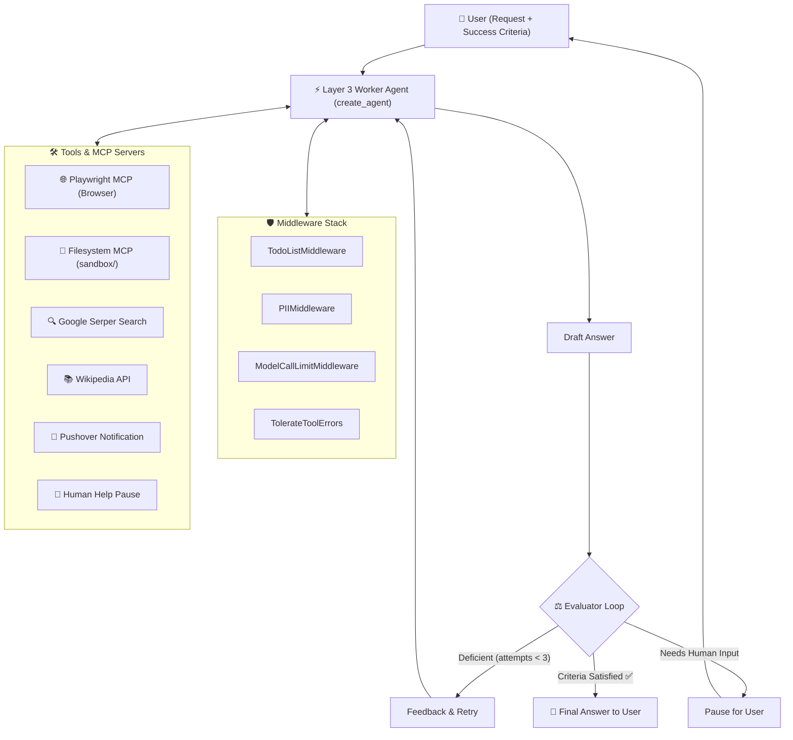

# 🤖 LangChain Sidekick

> **Your personal AI co-worker:** A LangChain / LangGraph worker agent wrapped in an evaluator loop, equipped with persistent Model Context Protocol (MCP) browser and filesystem tools, live todo plan tracking, and human-in-the-loop approvals.

[](https://huggingface.co/spaces/nakitadev/langchain-sidekick)
[](https://www.python.org/downloads/)
[](https://github.com/langchain-ai/langchain)
[](https://github.com/langchain-ai/langgraph)
[](https://gradio.app/)
[](https://modelcontextprotocol.io/)

---

## 🌐 Live Demo

Try the interactive demo deployed on Hugging Face Spaces:
- **Hugging Face Space:** [https://huggingface.co/spaces/nakitadev/langchain-sidekick](https://huggingface.co/spaces/nakitadev/langchain-sidekick)
- **Direct Web App:** [https://nakitadev-langchain-sidekick.static.hf.space](https://nakitadev-langchain-sidekick.static.hf.space)

---

## 🌟 Key Features

1. **Layer 3 Worker Agent (`create_agent`)**:
   - Backed by OpenRouter models (e.g. `openai/gpt-5.4-mini` or `openai/gpt-4o-mini`).
   - Equipped with real tools: a real headless/headed browser, a sandboxed filesystem, Google Search, and Wikipedia.

2. **Self-Correcting Evaluator Loop**:
   - The worker's output is checked by a dedicated evaluator agent against the user's explicit **Success Criteria**.
   - If the criteria are not met, the evaluator provides constructive feedback and re-dispatches the worker for another attempt (up to 3 attempts).

3. **Persistent Model Context Protocol (MCP)**:
   - **Playwright MCP (`@playwright/mcp`)**: Real browser automation that navigates pages, reads DOM snapshots, and dismisses popups/cookie banners.
   - **Filesystem MCP (`@modelcontextprotocol/server-filesystem`)**: Safely reads and writes artifacts inside a dedicated `sandbox/` directory.
   - **Persistent MCP Sessions**: Background stdio processes maintain browser sessions, cookies, and state across multiple tool calls within a turn.

4. **Middleware Protection Stack**:
   - `TodoListMiddleware`: Generates and shares a structured, live-updating plan with the Gradio UI.
   - `PIIMiddleware`: Redacts emails and credit card numbers from both prompt inputs and tool outputs.
   - `ModelCallLimitMiddleware`: Restricts maximum model invocations per turn to prevent runaway token costs.
   - `TolerateToolErrors`: Traps external tool/network exceptions and feeds them back as messages so the agent can recover gracefully instead of crashing.

5. **Human-in-the-Loop (HIL) Approvals**:
   - When encountering captchas, 2FA, logins, or sensitive actions, the agent pauses and triggers an approval button in the UI.

---

## 📐 Architecture Overview



---

## 🚀 Getting Started

### Prerequisites
- **Python 3.12+**
- **Node.js 18+** & `npx` (required for running `@playwright/mcp` and `@modelcontextprotocol/server-filesystem`)
- (Recommended) [uv](https://docs.astral.sh/uv/) package manager

---

### Installation

1. **Clone the repository:**
   ```bash
   git clone https://github.com/nakitadev/langchain-sidekick.git
   cd langchain-sidekick
   ```

2. **Install dependencies:**
   Using `uv` (recommended):
   ```bash
   uv sync
   ```
   Or using standard `pip`:
   ```bash
   python -m venv .venv
   source .venv/bin/activate
   pip install -r requirements.txt
   ```

3. **Configure Environment Variables:**
   Copy the example environment file:
   ```bash
   cp .env.example .env
   ```
   Edit `.env` and fill in your keys:
   ```env
   OPENROUTER_API_KEY=your_openrouter_api_key   # Required (openrouter.ai)
   SERPER_API_KEY=your_google_serper_api_key   # Required for web search (serper.dev)
   PUSHOVER_TOKEN=your_pushover_app_token       # Optional (pushover.net)
   PUSHOVER_USER=your_pushover_user_key         # Optional (pushover.net)
   ```

---

## 💻 Running the Application

Start the local Gradio interface:

```bash
uv run app.py
```
*(or `python app.py`)*

The web UI will launch in your default browser at `http://localhost:7860`:
1. Enter your **Request** (e.g. *"Find roundtrip flights from NYC to London departing July 14 returning July 21"*).
2. Enter your **Success Criteria** (e.g. *"List 3 airline options with times and prices strictly under $800"*).
3. Click **Go!** and watch the Sidekick plan, execute tools, and verify its response in real time.

---

## 📁 Repository Structure

```
.
├── app.py               # Gradio UI entrypoint and async event handlers
├── sidekick.py          # Worker agent, middleware stack, and evaluator loop
├── sidekick_tools.py    # MCP connections (Playwright, Filesystem) and standard tools
├── styles.py            # Brand styling, themes, and CSS for the Gradio app
├── pyproject.toml       # Project metadata and dependencies
├── requirements.txt     # Standard pip dependency requirements
├── sandbox/             # Dedicated persistent sandbox directory for file tools
└── hf_space/            # Hugging Face Space interactive deployment assets
    ├── index.html       # Standalone interactive web client
    ├── style.css        # Responsive styling system matching the Sidekick brand
    ├── app.js           # Client-side agent simulation, preset scenarios, and OpenRouter runner
    └── README.md        # Hugging Face Space card configuration and metadata
```

---

## ☁️ Hugging Face Space Deployment

The `hf_space/` directory contains the build for the live Hugging Face Space. To sync local changes with the Space:

```bash
hf upload nakitadev/langchain-sidekick hf_space . --repo-type space --exclude "**/__pycache__/**"
```

---

## 📜 License

This project is licensed under the MIT License.
